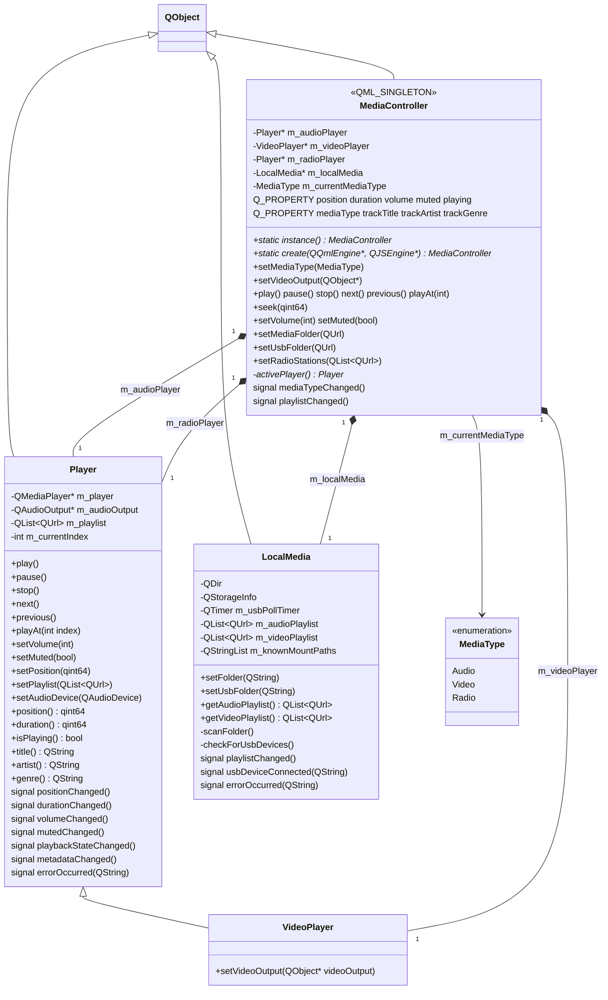

# Graduation Project —  Media Player

A Qt 6 (QML + C++) media player built for kiosk / infotainment-style displays (note the
`qtvirtualkeyboard` input method and the `WIN32_EXECUTABLE`/`MACOSX_BUNDLE` app packaging).
It plays  recitations and other media from three sources, selectable from a home screen:

- **Local** — browse a folder on disk and play its audio/video files.
- **USB** — same, but scoped to an auto-detected removable drive.
- **Radio** — stream one of three built-in internet Quran radio stations (Makkah, Cairo, Sharjah).

Playback (play/pause/stop/next/previous/seek/volume/mute), track metadata (title/artist/genre),
and video rendering are all exposed to QML through a single C++ singleton, `MediaController`.

## Tech stack

- **Qt 6.10+**, CMake 3.16+, C++
- Qt modules: `Qt6::Quick`, `Qt6::Multimedia` (no QtSql, no QtNetwork — radio streaming is
  handled internally by `QMediaPlayer`'s backend)
- Build target: `appGraduation_Project`, QML module URI `Graduation_Project`

## How it starts up

`src/main.cpp` sets `QT_IM_MODULE=qtvirtualkeyboard`, creates a `QGuiApplication` and a
`QQmlApplicationEngine`, and loads `Main.qml` from the `Graduation_Project` module. There is no
manual `qmlRegisterType`/`setContextProperty` call — `MediaController` registers itself into QML
declaratively via `QML_ELEMENT`/`QML_SINGLETON`, so every QML file just does
`import Graduation_Project` and refers to `MediaController` as a global singleton.

## Architecture at a glance

```
                     ┌───────────────────────────┐
                     │           QML UI           │
                     │  Main → HomePage →          │
                     │  LocalPage/UsbPage/RadioPage │
                     │   (all extend MediaBrowserPage) │
                     └──────────────┬──────────────┘
                                    │ Q_PROPERTY / Q_INVOKABLE
                                    ▼
                     ┌───────────────────────────┐
                     │   MediaController (singleton) │
                     │   facade exposed to QML        │
                     └──────┬───────────┬───────────┬─┘
                            │           │           │
                 owns       │  owns     │   owns    │  owns
                            ▼           ▼           ▼
                     ┌───────────┐┌───────────┐┌───────────┐   ┌────────────┐
                     │ Player     ││VideoPlayer││ Player     │   │ LocalMedia  │
                     │ (audio)    ││(inherits   ││ (radio)    │   │ (folder/USB │
                     │            ││ Player)    ││            │   │  scanning)  │
                     └───────────┘└───────────┘└───────────┘   └──────┬─────┘
                                                                       │ playlistChanged
                                                    fills playlists ◄──┘
                                                    into Player / VideoPlayer
```

`LocalMedia` never talks to `Player`/`VideoPlayer` directly — `MediaController` listens for its
`playlistChanged` signal and pushes the resulting playlists into the audio/video players. QML
never touches `Player`, `VideoPlayer`, or `LocalMedia` directly either; everything goes through
`MediaController`.

### Class diagram



## Class responsibilities

### `Player` — [include/player.h](include/player.h), [src/player.cpp](src/player.cpp)

Base playback engine. Wraps `QMediaPlayer` and `QAudioOutput` and owns its own playlist
(`QList<QUrl> m_playlist`, `int m_currentIndex`, starting at `-1` meaning nothing loaded).

**Qt classes used:**
- `QMediaPlayer` — `play()`, `pause()`, `stop()`, `setSource()`, `setPosition()`, `position()`,
  `duration()`, `playbackState()`, `metaData()`; signals `errorOccurred`, `positionChanged`,
  `durationChanged`, `playbackStateChanged`, `metaDataChanged`.
- `QAudioOutput` — `setVolume()`/`volume()`, `setMuted()`/`isMuted()`, `setDevice()`; signals
  `volumeChanged`, `mutedChanged`. Attached to the player via `m_player->setAudioOutput(m_audioOutput)`.
- `QMediaMetaData` — reads `Title`, `ContributingArtist`, `Genre` keys for track info.
- `qBound` — clamps volume input to 0–100 before converting to the 0.0–1.0 float `QAudioOutput` expects.

`next()`/`previous()` wrap around the playlist with modulo arithmetic and emit `errorOccurred`
if the playlist is empty. `m_player`/`m_audioOutput` are `protected` so `VideoPlayer` can reach
into `m_player` directly.

Used by `MediaController` twice — as the dedicated **audio** player and, separately, as the
**radio** player.

### `VideoPlayer` — [include/videoplayer.h](include/videoplayer.h), [src/videoplayer.cpp](src/videoplayer.cpp)

Inherits `Player` (a specialization, not composition — it reuses all of `Player`'s playback and
signal machinery). Adds a single method, `setVideoOutput(QObject *videoOutput)`, which calls
`QMediaPlayer::setVideoOutput()` to bind a QML `VideoOutput` item as the render target for
decoded video frames.

### `LocalMedia` — [include/LocalMedia.h](include/LocalMedia.h), [src/LocalMedia.cpp](src/LocalMedia.cpp)

Validates folders, scans them for supported media files, and auto-detects USB drive insertion.

**Qt classes used:**
- `QDir` — existence checks, `entryInfoList()` with name filters (`QDir::Files|QDir::Readable`,
  sorted `QDir::Name`) to list matching files.
- `QFileInfo` / `QUrl::fromLocalFile` — turns scanned files into playable `QUrl`s.
- `QStorageInfo` — `mountedVolumes()`, `isValid()`, `isReady()`, `isRoot()`, `rootPath()` to find
  and validate removable drives.
- `QTimer` — `m_usbPollTimer` fires every 2000 ms, connected to `checkForUsbDevices()` via `timeout`.

The constructor seeds `m_knownMountPaths` with every currently-mounted, non-root, ready volume
so only *newly* plugged drives are treated as new, then starts the poll timer.
`checkForUsbDevices()` diffs current mounted volumes against that known set; a new volume emits
`usbDeviceConnected(path)` and auto-calls `setUsbFolder(path)`.

`scanFolder()` builds a combined filter of audio suffixes (`mp3,wav,flac,aac,ogg,m4a,wma`) and
video suffixes (`mp4,mkv,avi,mov,webm,wmv,flv`), queries `QDir::entryInfoList`, and splits results
into `m_audioPlaylist`/`m_videoPlaylist` (both `QList<QUrl>`) by suffix — emitting
`playlistChanged()` on success or `errorOccurred()` if nothing was found.

Instantiated once inside `MediaController`; its `playlistChanged` signal is connected (via
lambda) to push fresh playlists into both the audio and video `Player`s.

### `MediaController` — [include/mediacontroller.h](include/mediacontroller.h), [src/mediacontroller.cpp](src/mediacontroller.cpp)

The single facade QML talks to. Marked `QML_ELEMENT` + `QML_SINGLETON`, implemented as a classic
C++ singleton: private constructor, deleted copy ctor/assignment, `static instance()` returning a
function-local static, and `static create(QQmlEngine*, QJSEngine*)` used by the QML engine's
singleton factory — which also calls `QQmlEngine::setObjectOwnership(instance(), CppOwnership)`
so QML never tries to delete it.

**Composition:** owns `Player* m_audioPlayer`, `VideoPlayer* m_videoPlayer`,
`Player* m_radioPlayer` (three independent playback engines, all parented to `this`), and
`LocalMedia* m_localMedia`. Tracks the active source via
`enum class MediaType { Audio, Video, Radio }` (`Q_ENUM`).

**Q_PROPERTY (all read-only, NOTIFY-driven):** `position`, `duration` (`qint64`), `volume` (`int`),
`muted`, `playing` (`bool`), `mediaType` (`MediaType`), `trackTitle`, `trackArtist`, `trackGenre`
(`QString`).

**Q_INVOKABLE:** `setMediaType()`, `setVideoOutput()`, `play()`, `pause()`, `stop()`, `next()`,
`previous()`, `playAt()`, `seek()`, `setVolume()`, `setMuted()`, `setMediaFolder()`,
`setUsbFolder()`, `getAudioPlaylist()`, `getVideoPlaylist()`, `setRadioStations()`.

A private `activePlayer()` switches on `m_currentMediaType` to return whichever of the three
`Player`s is "current" — every playback/property method delegates to it, so only one source plays
at a time. The constructor wires up signal fan-in: each player's `positionChanged`,
`durationChanged`, `volumeChanged`, `mutedChanged`, `playbackStateChanged`, `errorOccurred`, and
`metadataChanged` signals are individually forwarded to the matching `MediaController` signal
(repeated for all three players), so QML only ever listens on the controller. `setMediaType()`
stops the previously active player, switches the enum, and re-emits every property-changed
signal since "the active player" — and thus what those properties read — just changed.

## QML views

- **`Main.qml`** — `ApplicationWindow` root; a `StackView` starting on `HomePage`, handling
  push/pop navigation.
- **`HomePage.qml`** — landing screen (`AnimatedBackground` + ITI watermark) with three
  `AppButton`s ("Local", "USB", "Radio") that push the corresponding page. No C++ binding.
- **`MediaBrowserPage.qml`** — shared base UI reused by Local/USB/Radio via QML inheritance.
  Binds to `MediaController.mediaType/trackTitle/trackArtist/trackGenre/position/duration/
  playing/volume/muted`, calls `setVideoOutput()`, `play()/pause()/stop()/next()/previous()`,
  `seek()`, `setMuted()`, `setVolume()`, `setMediaType()`. Hosts a `VideoOutput` item for video
  rendering plus transport controls (`AppSlider`, `IconButton`).
- **`LocalPage.qml`** — extends `MediaBrowserPage`; sets `MediaType.Audio` on load; opens a
  `FolderDialog` and calls `MediaController.setMediaFolder()`.
- **`UsbPage.qml`** — same pattern, calls `MediaController.setUsbFolder()`.
- **`RadioPage.qml`** — extends `MediaBrowserPage` with `isLive: true`; hardcodes 3 Quran radio
  stream URLs (Makkah/Cairo/Sharjah), sets `MediaType.Radio` and `setRadioStations()` on load;
  a popup `ListView` of stations calls `MediaController.playAt(index)` on selection.
- **`AppButton.qml` / `AppSlider.qml` / `AnimatedBackground.qml` / `IconButton.qml`** — reusable,
  pure-UI styled components with no direct C++ bindings.

## Data / external resources

- No database — no QtSql usage anywhere in the project.
- Three hardcoded internet radio stream URLs (Quran recitation) in `RadioPage.qml`, played via
  `QMediaPlayer`'s native HTTP/ICY streaming (no explicit `QNetworkAccessManager` code needed).
- 13 bundled images under `assets/images/` (background, watermark, folder icon, playback icons),
  registered as CMake `RESOURCES`.
